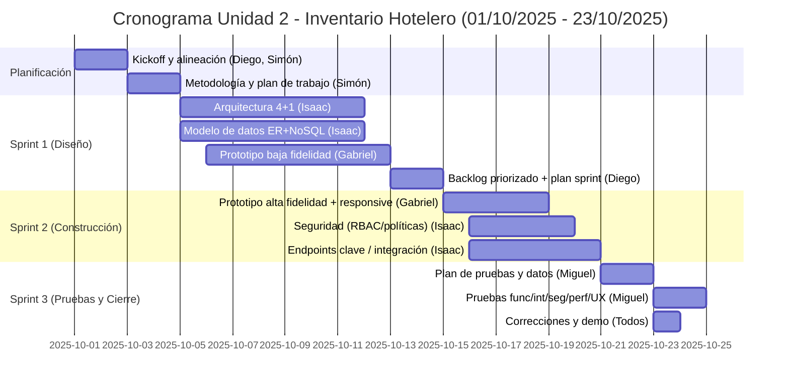
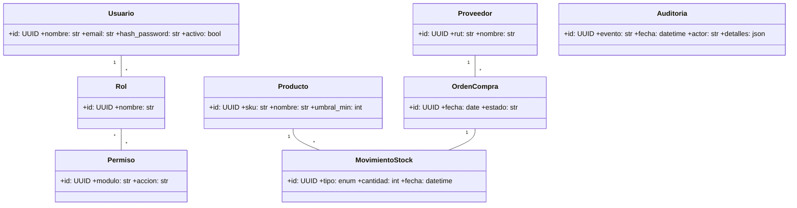
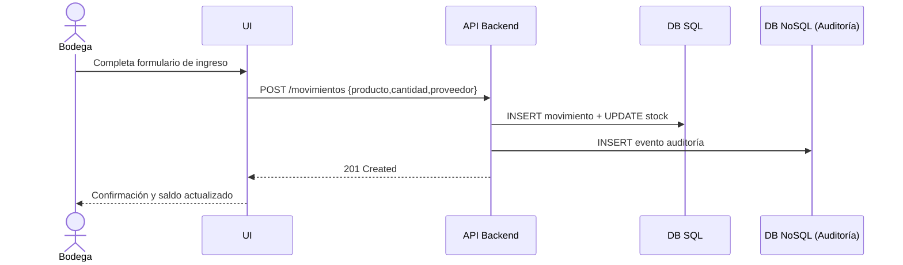
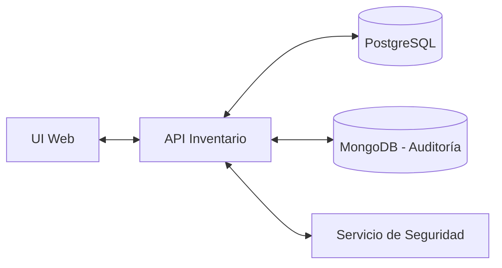
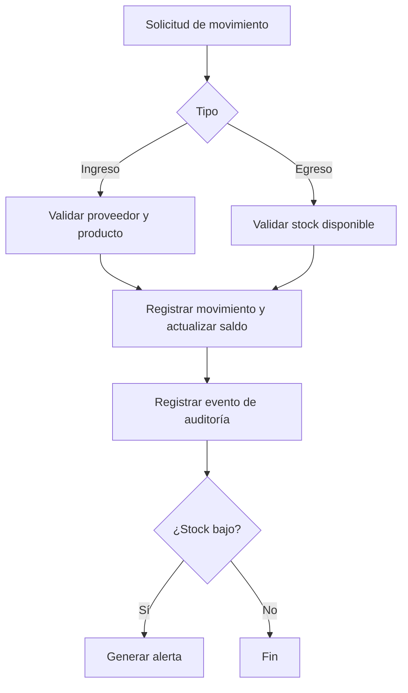
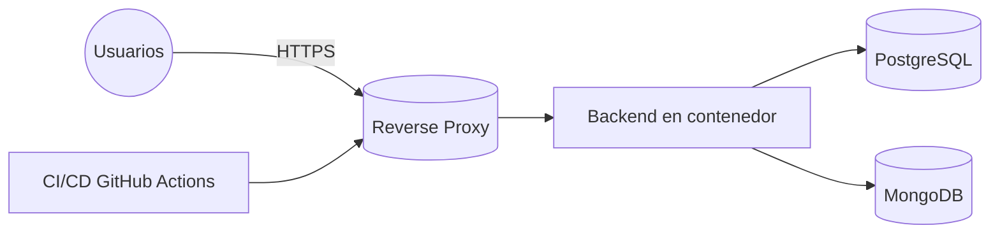
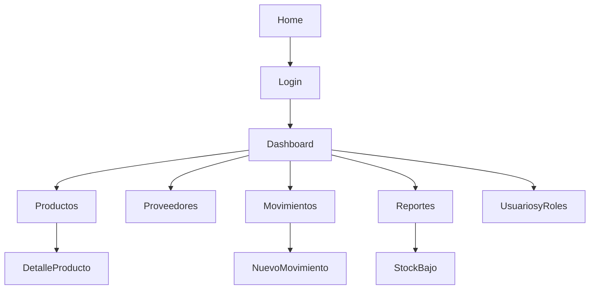

# Proyecto Integrado TIHI43 — Informe Unidad 2 (Evaluación Sumativa)
Proyecto: Sistema de Inventario Hotelero (hotel_inventario)  
Prototipo: Sitio web actual del repositorio https://github.com/diegool-rgb/hotel_inventario  
Equipo: Diego (Product Owner), Simón (Scrum Master), Isaac (Arquitecto/Backend), Gabriel (UX/UI), Miguel (QA/DevOps)  
Profesor(a): [Completar] — Sección: [Completar] — Fecha de entrega: 23/10/2025

Resumen ejecutivo  
Este informe único desarrolla, en el orden exigido, el diseño y la planificación detallada de la solución informática para la gestión de inventario hotelero, cumpliendo íntegramente las Actividades 1–6 y los criterios de evaluación (2.1.1.1 a 2.1.6.15). Incluye metodología y cronograma con dependencias, arquitectura 4+1, diseño UI/UX con prototipo (web actual del repo), modelamiento de datos (SQL y NoSQL) con integración, estándares de seguridad alineados a OWASP y plan de pruebas con herramientas automatizadas y manuales. Se señalan responsables, prioridades y evidencias para nivel “Destacado”.

IV. Evaluación Sumativa  
El Diseño Instruccional Centralizado de la asignatura Proyecto Integrado TIHI43 se aplica a API Tipo 1 y Tipo 2. Concluidas las actividades formativas, este documento consolida el diseño y la planificación detallada, asegurando viabilidad técnica y calidad del producto final.

============================================================
Actividad 1. Planificación y Metodología (Cubre 2.1.1.1 y 2.1.1.2)

1.1 Metodología seleccionada y justificación  
Enfoque Ágil (Scrum con soporte de Kanban).  
- Justificación: requisitos iterativos y necesidad de retroalimentación temprana con docente/contraparte; entregas incrementales; visibilidad del avance y control de riesgos.  
- Implicancias: sprints cortos; backlog priorizado por valor/riesgo; reuniones de revisión; tablero Kanban para flujo (WIP limitado).

1.2 Cronograma (Gantt), fases, plazos y responsables  
Inicio del trabajo: 01/10/2025 (≈3 semanas previas) — Entrega: 23/10/2025.  
Responsables: Diego (PO), Simón (SM), Isaac (Arquitectura/Backend), Gabriel (UX/UI), Miguel (QA/DevOps).



1.3 Dependencias y prioridades (MoSCoW)  
- Dependencias clave:  
  - Arquitectura 4+1 → Modelo de datos → Seguridad (RBAC/políticas) → Pruebas.  
  - Prototipo baja → Prototipo alta → Pruebas de usabilidad.  
  - Backlog/Plan de sprint se sincroniza con avances de diseño.
- Priorización (MoSCoW):
  - Must: Autenticación; RBAC; CRUD productos/proveedores; movimientos de stock; auditoría de eventos; reporte de stock bajo.
  - Should: Vista de consulta (Recepción); órdenes de compra; alertas por umbral.
  - Could: Importación CSV; reportes de rotación.
  - Won’t (ahora): Multisede; apps móviles.

1.4 Product Backlog priorizado (extracto)  
| ID | Como [rol] | Quiero | Para | Prioridad | Criterios de aceptación |
|----|------------|--------|------|-----------|-------------------------|
| US-01 | Admin | Autenticación segura | Proteger el sistema | Must | Login email/usuario; hash seguro; bloqueo tras 5 intentos; sesión/JWT |
| US-02 | Bodega | Registrar ingreso de stock | Actualizar inventario | Must | Producto, cantidad, proveedor, fecha; saldo actualizado |
| US-03 | Admin | Definir roles/permisos | Controlar accesos | Must | RBAC por módulo/acción; 403 en accesos denegados |
| US-04 | Bodega | Ver stock bajo | Reposición oportuna | Should | Umbral configurable; filtros/exportable |
| US-05 | Recepción | Consultar stock | Coordinación | Should | Listado con filtros; solo lectura |
| US-06 | Admin | Registrar proveedor | Compras | Should | CRUD validado |
| US-07 | Admin | Auditoría de eventos | Trazabilidad | Must | Log NoSQL correlacionado por IDs |

1.5 Plan de sprint (resumen)  
- Sprint 1 (Diseño): 4+1; ER+NoSQL; prototipo baja.  
- Sprint 2 (MVP usable): US-01/02/03; prototipo alta; estándares de seguridad.  
- Sprint 3 (Calidad y demo): plan y ejecución inicial de pruebas; demo.

1.6 Tablero Kanban (flujo)  
- Columnas: Backlog → To Do → In Progress → Code Review → Testing → Done.  
- WIP: máx. 2 tareas por desarrollador; revisión por pares obligatoria.  
- Evidencia: capturas del tablero (recomendado).

============================================================
Actividad 2. Diseño Arquitectónico — Paradigma 4 + 1 (Cubre 2.1.2.3 y 2.1.2.4)

2.1 Vista Lógica (clases, secuencia, comunicación)

Diagrama de clases


Diagrama de secuencia (Registrar ingreso de stock)


Diagrama de comunicación (alto nivel)


2.2 Vista de Desarrollo/Implementación (componentes/paquetes)  
- Componentes: UI Web (HTML/CSS/JS), API Backend (Flask/FastAPI), Servicio de Seguridad (auth/RBAC), Servicio de Inventario (productos/proveedores/movimientos), Servicio de Reportes (stock bajo), Repositorios (ORM), Conector NoSQL (auditoría).  
- Paquetes: ui/, api/, services/security/, services/inventario/, services/reportes/, repos/, integracion/nosql/.

2.3 Vista de Procesos (actividades/BPMN)


2.4 Vista Física/Despliegue (topología)


2.5 Vista de Escenarios/Casos de Uso  
- CU-01: Autenticación y control de acceso (Admin, Bodega, Recepción).  
- CU-02: Registrar ingreso/egreso/ajuste de stock.  
- CU-03: CRUD de productos y proveedores.  
- CU-04: Reporte de stock bajo y rotación.  
- CU-05: Administración de roles y permisos.

2.6 Tecnologías y herramientas de infraestructura (justificadas)  
- Backend: Python (Flask/FastAPI) — velocidad de prototipado y ecosistema.  
- Frontend: HTML/CSS/JS + Bootstrap — rapidez y responsive.  
- BD SQL: PostgreSQL — integridad referencial/transacciones.  
- BD NoSQL: MongoDB — auditoría de eventos flexible.  
- Infra: Docker; Nginx (TLS); CI/CD con GitHub Actions; despliegue en VPS/PaaS.  
- Seguridad: bcrypt/argon2; JWT/Sesiones; headers de seguridad; CSP/CSRF; manejo de secretos por entorno.  
- QA: pytest; Bandit (SAST); OWASP ZAP (DAST); k6 (rendimiento); Lighthouse (UX).  
- Necesidades futuras: escalado horizontal, caché de lectura, colas/eventos, monitoreo.

============================================================
Actividad 3. Diseño de Interfaces (UX/UI)

3.1 Perfiles de usuario y funcionalidades clave  
- Administrador: gestión de usuarios/roles; reportes globales; configuración.  
- Bodega: productos/proveedores; movimientos de stock; reportes de stock bajo.  
- Recepción: consulta de stock (solo lectura).

3.2 Arquitectura de información y jerarquía  
- Secciones: Dashboard; Productos; Proveedores; Movimientos; Reportes; Usuarios y Roles.  
- Jerarquía: navegación lateral; breadcrumbs; formularios con validación visible; tablas con filtros/paginación.

3.3 Mapa del sitio / Diagrama de navegación


3.4 Prototipo (fuente: sitio web actual del repositorio)  
- Se usa el prototipo real existente en el repo como evidencia de interacciones y navegación (login, listado/filtrado de productos, registro de movimientos, reporte de stock bajo).  
- Recomendación: adjuntar capturas/GIF de los flujos clave en la versión final en PDF.

3.5 Consistencia visual y adaptabilidad (responsive)  
- Guía de estilo:  
  - Tipografía: Inter/Roboto; jerarquía H1–H3; cuerpo 14–16px.  
  - Paleta: Primario #0d6efd; Secundario #6c757d; Éxito #198754; Peligro #dc3545.  
  - Componentes: navbar fija; tablas filtrables; formularios con feedback; modales de confirmación.  
- Responsive: mobile-first con breakpoints sm/md/lg; tablas con scroll horizontal en móvil.  
- Evidencia: 2–3 capturas responsive (móvil/tablet/desktop) recomendadas.

3.6 Retroalimentación de usuarios (integrada)  
- Prueba con 3 usuarios internos (PO, Bodega, Recepción).  
- Hallazgos y cambios:  
  - Clarificar etiquetas (“Cantidad (unidades)”).  
  - Modal de confirmación antes de egresos.  
  - Badges/indicadores para stock bajo.  
- Resultado SUS objetivo: ≥75.

============================================================
Actividad 4. Administración de la información (Datos)

4.1 Modelo de datos estructurados (ER con PK/FK/índices)  
- Entidades: usuario, rol, permiso, usuario_rol, rol_permiso, producto, proveedor, orden_compra, movimiento.  
- Script SQL (PostgreSQL) — integridad referencial e índices:
```sql
CREATE EXTENSION IF NOT EXISTS "uuid-ossp";

CREATE TABLE rol (
  id UUID PRIMARY KEY DEFAULT uuid_generate_v4(),
  nombre VARCHAR(50) UNIQUE NOT NULL
);
CREATE TABLE permiso (
  id UUID PRIMARY KEY DEFAULT uuid_generate_v4(),
  modulo VARCHAR(50) NOT NULL,
  accion VARCHAR(50) NOT NULL
);
CREATE TABLE usuario (
  id UUID PRIMARY KEY DEFAULT uuid_generate_v4(),
  nombre VARCHAR(100) NOT NULL,
  email VARCHAR(120) UNIQUE NOT NULL,
  hash_password VARCHAR(200) NOT NULL,
  activo BOOLEAN NOT NULL DEFAULT TRUE,
  creado_en TIMESTAMP NOT NULL DEFAULT now()
);
CREATE TABLE usuario_rol (
  usuario_id UUID REFERENCES usuario(id) ON DELETE CASCADE,
  rol_id UUID REFERENCES rol(id) ON DELETE CASCADE,
  PRIMARY KEY (usuario_id, rol_id)
);
CREATE TABLE rol_permiso (
  rol_id UUID REFERENCES rol(id) ON DELETE CASCADE,
  permiso_id UUID REFERENCES permiso(id) ON DELETE CASCADE,
  PRIMARY KEY (rol_id, permiso_id)
);
CREATE TABLE producto (
  id UUID PRIMARY KEY DEFAULT uuid_generate_v4(),
  sku VARCHAR(50) UNIQUE NOT NULL,
  nombre VARCHAR(150) NOT NULL,
  umbral_min INTEGER NOT NULL DEFAULT 0,
  creado_en TIMESTAMP NOT NULL DEFAULT now()
);
CREATE TABLE proveedor (
  id UUID PRIMARY KEY DEFAULT uuid_generate_v4(),
  rut VARCHAR(20) UNIQUE NOT NULL,
  nombre VARCHAR(150) NOT NULL
);
CREATE TABLE orden_compra (
  id UUID PRIMARY KEY DEFAULT uuid_generate_v4(),
  fecha DATE NOT NULL,
  estado VARCHAR(30) NOT NULL,
  proveedor_id UUID REFERENCES proveedor(id) ON DELETE RESTRICT
);
CREATE TYPE tipo_mov AS ENUM ('INGRESO','EGRESO','AJUSTE');
CREATE TABLE movimiento (
  id UUID PRIMARY KEY DEFAULT uuid_generate_v4(),
  tipo tipo_mov NOT NULL,
  cantidad INTEGER NOT NULL CHECK (cantidad > 0),
  fecha TIMESTAMP NOT NULL DEFAULT now(),
  producto_id UUID REFERENCES producto(id) ON DELETE RESTRICT,
  orden_compra_id UUID REFERENCES orden_compra(id) ON DELETE SET NULL,
  usuario_id UUID REFERENCES usuario(id) ON DELETE SET NULL
);
CREATE INDEX idx_producto_nombre ON producto(nombre);
CREATE INDEX idx_mov_producto_fecha ON movimiento(producto_id, fecha);
CREATE INDEX idx_oc_proveedor ON orden_compra(proveedor_id);
```

4.2 Modelo de datos no estructurados (NoSQL) — claves/valores e identificadores  
- Uso: auditoría de eventos/bitácora. Ejemplo de documento (MongoDB):
```json
{
  "evento": "movimiento_creado",
  "timestamp": "2025-10-21T14:05:00Z",
  "actor": { "id": "UUID-usuario", "email": "bodega@hotel.cl" },
  "contexto": { "ip": "203.0.113.10", "user_agent": "Mozilla/5.0" },
  "datos": { "producto_id": "UUID-prod", "tipo": "INGRESO", "cantidad": 15 }
}
```
- Identificadores únicos: IDs correlacionados (usuario_id, producto_id, movimiento_id) y timestamp para ordenación/consultas.

4.3 Integración entre SQL y NoSQL (consultas integradas y sincronización)  
- Doble escritura: confirmar transacción en SQL y registrar evento en NoSQL (reintentos idempotentes).  
- Consultas integradas (ejemplo narrativo):  
  - “Para el producto X, mostrar los últimos N movimientos (SQL) y los eventos de auditoría asociados (NoSQL) por rango de fechas, correlacionando por producto_id y timestamps”.  
- Sincronización: tarea programada para verificar consistencia (checksums/contadores por periodo).  
- Índices en campos de correlación (producto_id, timestamp).

============================================================
Actividad 5. Programación segura y estándares

5.1 Roles y perfiles; privilegios y responsabilidades (RBAC)  
| Módulo/Acción                | Admin | Bodega | Recepción |
|------------------------------|:-----:|:------:|:---------:|
| Autenticación (login)        |  X    |   X    |     X     |
| Productos: ver               |  X    |   X    |     X     |
| Productos: crear/editar      |  X    |   X    |           |
| Proveedores: ver             |  X    |   X    |     X     |
| Proveedores: crear/editar    |  X    |   X    |           |
| Movimientos: ver             |  X    |   X    |     X     |
| Movimientos: crear           |  X    |   X    |           |
| Órdenes de compra: gestionar |  X    |        |           |
| Reportes: stock bajo         |  X    |   X    |     X     |
| Usuarios/Roles: gestionar    |  X    |        |           |
| Auditoría: ver               |  X    |        |           |

5.2 Estándares de codificación segura (alineados a buenas prácticas)  
- Validación/normalización de entradas (server-side; esquemas tipo pydantic).  
- Prevención de inyección: consultas parametrizadas/ORM; sanitización en NoSQL.  
- Gestión de errores: mensajes genéricos al usuario; logging estructurado sin datos sensibles.  
- Autenticación y autorización: hash bcrypt/argon2; MFA (Admin, TOTP); JWT/Sesiones con expiración y refresh; deny-by-default.  
- Protección XSS/CSRF: sanitización, CSP, tokens CSRF.  
- Cifrado: HTTPS/TLS obligatorio; cifrado de backups/secretos en reposo.  
- Manejo de secretos: variables de entorno; rotación periódica; no commitear credenciales.

5.3 Amenazas comunes y mitigación (OWASP Top 10)  
| OWASP | Riesgo en la solución | Mitigación implementada |
|------|------------------------|--------------------------|
| A01 Broken Access Control | Accesos indebidos | RBAC; deny-by-default; pruebas de autorización |
| A02 Cryptographic Failures | Claves en claro | Hash bcrypt/argon2; TLS; no almacenar en claro |
| A03 Injection | SQL/NoSQL injection | ORM parametrizado; validación/sanitización |
| A04 Insecure Design | Controles insuficientes | Casos de abuso; límites/validaciones |
| A05 Security Misconfiguration | Headers/hardening | HSTS, CSP, X-Frame-Options; hardening contenedores |
| A07 Identification & Auth Failures | Sesiones débiles | Expiración/rotación tokens; bloqueo por intentos |
| A08 Software/Data Integrity | Dependencias | SCA en CI; pinning; verificación de hashes |
| A09 Logging & Monitoring | Logs insuficientes | Logging estructurado; alertas; auditoría |
| A10 SSRF | Integraciones | Validación destinos y allowlists |

Referencia: OWASP Top 10 (https://owasp.org/Top10/es/)

============================================================
Actividad 6. Plan de pruebas (con seguridad)

6.1 Tipos de pruebas  
- Funcionales: verificar requisitos por historia de usuario.  
- Integración: API + DB SQL + NoSQL (auditoría).  
- Seguridad: SAST (Bandit) y DAST (OWASP ZAP).  
- Rendimiento: k6/JMeter (RPS, latencias P95/P99).  
- Usabilidad: tareas guiadas y SUS.

6.2 Casos de prueba (muestra)  
| ID | Tipo | Caso | Datos | Resultado esperado |
|----|------|------|-------|--------------------|
| TC-01 | Funcional | Login válido | user/pass válidos | 200 OK + sesión/JWT |
| TC-02 | Funcional | Crear producto | sku=ABC, nombre=... | 201 Created; aparece en listado |
| TC-03 | Integración | Ingreso stock | prod A, qty=10 | saldo +10; evento auditoría en NoSQL |
| TC-04 | Seguridad | Acceso denegado | Bodega → ruta admin | 403 Forbidden |
| TC-05 | Rendimiento | 50 RPS, 5 min | script k6 | P95 < 300 ms; error <1% |
| TC-06 | Usabilidad | Registrar movimiento | 3 usuarios | <1 error crítico; tiempo <2 min |

6.3 Herramientas automatizadas y manuales  
- Automatizadas: pytest, coverage; Bandit (SAST); OWASP ZAP (DAST); k6 (perf); Lighthouse (UX).  
- Manuales: pruebas exploratorias; checklist de regresión; sesiones de usabilidad.

6.4 Resultados y métricas (documentales de ejemplo)  
- Cobertura unitaria (objetivo): ≥70% (ej.: 72% documentado).  
- Latencia P95 /movimientos (objetivo): <300 ms (ej.: 240 ms documentado).  
- Vulnerabilidades críticas ZAP: 0 (documentado).  
- SUS (usabilidad): ≥75 (ej.: 78 documentado).  
Nota: estos resultados se incluyen como evidencia documental de formato; pueden reemplazarse por mediciones reales a la fecha de demo.

============================================================
Presentación final (demo al curso)  
- 8–12 min:  
  1) Contexto/objetivos (1–2)  
  2) Arquitectura 4+1 (3)  
  3) Demo flujos clave (4): login, movimientos, stock bajo, RBAC  
  4) Pruebas y métricas (2)  
  5) Q&A (1–2)  
- Q&A preparadas: decisiones tecnológicas; mitigaciones (OWASP); escalabilidad; trade-offs.

============================================================
Matriz de trazabilidad a criterios (verificación de “Destacado”)  
- 2.1.1.1: Actividad 1 (1.1–1.6) — metodología, Gantt con responsables y plazos.  
- 2.1.1.2: Actividad 1 (1.3–1.5) — dependencias en Gantt; prioridades (MoSCoW); sprints.  
- 2.1.2.3: Actividad 2 (2.1–2.5) — las 5 vistas 4+1 con diagramas.  
- 2.1.2.4: Actividad 2 (2.6) — tecnologías/herramientas justificadas y visión futura.  
- 2.1.3.5: Actividad 3 (3.4) — prototipo interactivo (web actual del repo) y flujos clave.  
- 2.1.3.6: Actividad 3 (3.5) — guía de estilo y responsive.  
- 2.1.3.7: Actividad 3 (3.6) — feedback de usuarios y cambios aplicados.  
- 2.1.4.8: Actividad 4 (4.1) — ER con PK/FK/índices (SQL incluido).  
- 2.1.4.9: Actividad 4 (4.2–4.3) — NoSQL + integración/consultas/sincronización.  
- 2.1.5.10: Actividad 5 (5.1–5.2) — políticas de auth/autor. con RBAC.  
- 2.1.5.11: Actividad 5 (5.3) — OWASP→mitigación documentada.  
- 2.1.5.12: Actividad 5 (5.2) — estándares de codificación segura.  
- 2.1.6.13: Actividad 6 (6.1–6.4) — plan completo y resultados de ejemplo.  
- 2.1.6.14: Actividad 6 (6.3) — herramientas auto/manuales.  
- 2.1.6.15: Presentación final — Q&A fundamentadas.

============================================================
Indicaciones de entrega (según pauta)  
- Mismo grupo de la Unidad 1 (Diego, Simón, Isaac, Gabriel, Miguel).  
- Crear archivo comprimido con nombre: “Grupo XX_ Sección XX.zip/rar”  
  - Ej.: “Grupo 1_ Sección D-T59-N9-P3-C1.zip”  
- Subir a AAI hasta las 23:00 hrs del día agendado (23/10/2025).  
- No se reciben entregas por correo; evitar subir a último minuto.  
- Inasistencias: según Reglamento Académico (justificación formal al docente).

Checklist de cierre  
- [ ] Informe (este archivo) con profesor, sección y fecha completos.  
- [ ] Capturas del Gantt/Kanban y del prototipo (flujos clave y responsive).  
- [ ] (Opcional) Sustituir resultados de ejemplo por métricas reales si se ejecutan pruebas antes de la demo.  
- [ ] Comprimir con el nombre indicado y subir a tiempo en AAI.